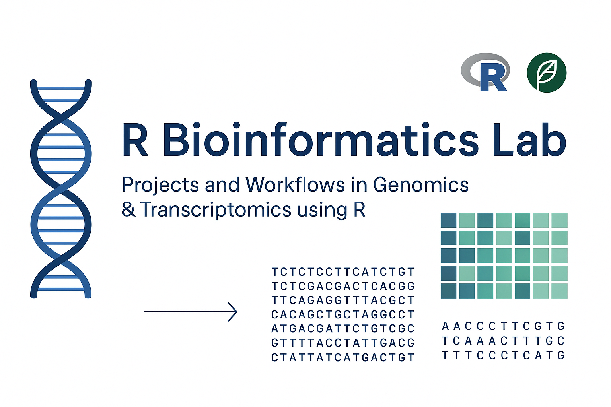

  

# 🧬 R Bioinformatics Lab

Welcome to the **R Bioinformatics Lab** — a structured and evolving portfolio documenting my journey to master bioinformatics using **R**. This lab focuses on practical, project-based learning using core R libraries, including `tidyverse`, `Bioconductor`, and `ggplot2`.

> 📌 _Goal: Build real-world skills in bioinformatics using R programming._

---

## 🧭 Structure

This repository is organized into modules, each reflecting a core area of learning or application:

| Folder | Description |
|--------|-------------|
| `00_Basics/`         | R basics, syntax, data types, tidyverse, ggplot2, and intro plots |
| `01_data_handling/`       | Reading, filtering, transforming CSV/TSV/Excel datasets |
| `02_data_visualization/`  | Creating effective plots with `ggplot2` for biological data |
| `03_biological_data_types/` | Handling DNA, RNA, Protein sequences and formats |
| `04_sequence_analysis/`   | Working with FASTA, GC content, ORFs, and motif finding |
| `05_data_wrangling/`      | Using `dplyr`, `tidyr` for biological data manipulation |
| `06_exploratory_projects/`| Real-world mini-projects combining analysis & storytelling |
| `LICENSE`                 | Optional license for reuse or contribution |
| `A_banner.png`            | Visual banner for repository (optional aesthetic) |

---

## 🚀 Goals

- Master **R programming** for bioinformatics
- Learn and implement **data analysis pipelines**
- Build a strong **portfolio with reproducible notebooks**

---

## 🛠️ Tools & Libraries

- `R`, `tidyverse`, `ggplot2`, `readr`, `dplyr`, `Bioconductor`
- `Biostrings`, `DESeq2`, `edgeR`, `limma`, `shiny`, `plotly`
- File formats: `.fasta`, `.fastq`, `.gtf`, `.csv`

---

## 📚 Learning Resources

A mix of courses, papers, and tutorials supports this journey:
- Research papers and public datasets
- Many of the insights, code examples, and explanations in this lab were crafted with the help of ChatGPT by OpenAI — acting as my coding guide and tutor.

## 📌 Follow Along

This lab is part of a broader content series:
- 🔬 Blog: _Coming soon_
- 📺 YouTube Channel: _Coming soon (learning journey, tutorials, and projects)_

---

## 🤝 Contributing

This is a personal learning project, but suggestions and collaborations are welcome. Feel free to open issues or share ideas.

---

## 📄 License

This repository is licensed under the [MIT License](LICENSE).

---
